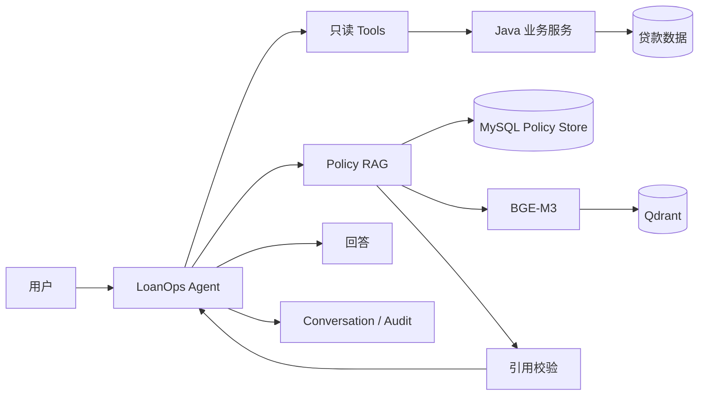

# LoanOps Agent：面向贷后运营的可审计智能 Agent🤖

LoanOps Agent 是一个基于 **Java 21 / Spring Boot / Spring AI** 开发的贷后运营智能 Agent🤖。

它面向“为什么逾期、还欠多少钱、按照规定应该怎么处理”这类问题：金融事实由确定性的 Java 后端服务计算，Agent 通过只读 Tool 查询；政策依据从版本化 Policy 知识库检索，并以 `[P1]`、`[P2]` 的形式给出引用。LLM 负责理解问题、选择工具和组织回答，而不是自行计算金额、日期或贷款状态。

当前项目已经实现：

**Tool Calling → 持久化多轮会话 → Policy RAG → 引用校验 → Audit → SSE 流式对话**

> 本仓库中的贷款数据与政策语料均为人为构造的数据，仅用于工程验证，不代表真实银行业务数据、内部制度或监管政策。

## 项目能做什么

| 场景 | 示例 | 主要能力 |
|---|---|---|
| 贷款事实查询 | `LN-10002 为什么逾期？` | Tool Calling + Java 业务规则 |
| 多轮追问 | `那他现在还欠多少钱？` | 持久化 Conversation + fresh Tool query |
| 政策依据查询 | `按照规定现在应该怎么处理？` | Policy Router + RAG + Citation |
| 条款追问 | `这个规定具体是哪一条？` | Policy Evidence + `[P1]` / `[P2]` |

### 一次真实手工测试

```text
You: LN-10002 为什么逾期？

Agent:
应还金额：8500.00
已还金额：5000.00
当前欠款金额：3500.00
还款日：2026-08-20
业务日期：2026-09-10
逾期天数：21 天
```

继续在同一个会话中询问：

```text
You: 按照规定现在应该怎么处理？

Agent:
[P1] 贷款发生逾期后，应当依法采取催收、协议重组、
     债权转让或者核销等方式进行处置。

[P2] 逾期天数是风险分类的重要参考，但不得仅以逾期天数
     替代对偿债能力的综合判断。

结合当前欠款 3500.00、逾期 21 天的业务事实……
```

继续追问：

```text
You: 那他现在还欠多少钱？

Agent:
LN-10002 当前期剩余欠款为 3500.00。
```

以及：

```text
You: 这个规定具体是哪一条？

Agent:
[P1]《贷后管理评测规程》2026 版第四十四条
[P2]《金融资产风险分类评测规程》2026 版第十二条
```


## 核心能力

| 能力 | 当前实现 |
|---|---|
| 确定性金融事实 | Java Service 使用 `BigDecimal`、`LocalDate`、可注入 `Clock` 计算还款、逾期与结清事实 |
| 只读 Tool Calling | 3 个 Spring AI Tools：当前还款、逾期诊断、结清状态 |
| 持久化多轮会话 | USER / ASSISTANT transcript 持久化到 MySQL，支持上下文指代与并发安全提交 |
| Policy RAG | MySQL 版本化 Policy Store + BGE-M3 Embedding + Qdrant |
| 政策引用 | `[P1]`、`[P2]` 必须映射到真实检索证据，并通过确定性 Citation Validator |
| 多模型切换 | DeepSeek、Ollama / qwen3:4b、GLM / glm-5.2 |
| Audit | Agent、Tool、Policy Retrieval 均保留可关联审计记录 |
| 流式对话 | Terminal Chat 通过 SSE 接收响应；Policy 回答在引用校验和成功提交后再下发 |
| 可复现评测 | 固定 Agent baseline、30-case Policy RAG Gold Dataset、真实 Provider Hero E2E |
| 本地 Policy 初始化 | 显式、幂等、安全的 Demo Policy Bootstrap，不覆盖未知 Policy 数据 |

## 系统架构



系统遵循一个核心原则：

> **LLM 负责理解与编排，确定性系统负责事实。**

金融金额、日期、逾期状态和结清状态不会交给 LLM 自行计算。

政策方面，MySQL 保存 Policy 文档、版本、有效期与 chunk，是政策事实来源；Qdrant 只保存可以从 MySQL + BGE-M3 重建的派生向量索引。

更完整的请求链路、Streaming 提交语义和失败边界见 [系统架构](docs/ARCHITECTURE.md)。

## 为什么这样设计

### 金融事实不交给 LLM

金额与日期是确定性业务事实。把这些规则写进 Prompt，不但难以测试，也可能因为模型或上下文变化得到不同结果。

因此项目保持：

```text
用户问题
  ↓
Agent 选择 Tool
  ↓
Java Service 计算事实
  ↓
Agent 解释结果
```

普通 REST / Service 测试可以绕过 AI 独立验证同一业务事实。

### Policy RAG 与贷款事实分开

贷款数据回答：

> 现在发生了什么？

Policy RAG 回答：

> 按照规定应该如何理解？

两类事实来源分别建模、分别审计，避免把业务状态与政策文本混在 Prompt 中交给模型猜测。

### MySQL 是 Policy 事实源，Qdrant 只是索引

Policy 文档、版本、适用日期和 chunk 元数据保存在 MySQL。

Qdrant 中的向量可以重新生成，因此向量数据库不是 Policy 的最终事实来源。

### Agent 保持只读

当前 Agent 没有修改贷款、还款计划或付款记录的 Tool。

金融写操作会引入权限、审批、确认、幂等、补偿和人工复核等新的安全边界，因此本项目首先聚焦于**可审计的只读诊断**。

## 快速开始

完整说明见 [本地运行与验收手册](docs/RUNBOOK.md)。下面只保留最快体验路径。

### 环境要求

- Java 21
- Maven 3.9+
- Docker
- Ollama
- PowerShell 7

### 1. 启动 MySQL 和 Qdrant

```powershell
docker compose up -d mysql qdrant
docker compose ps
```

### 2. 准备 Policy Embedding 模型

```powershell
ollama pull bge-m3
```

### 3. 初始化本地 Demo Policy

```powershell
./scripts/bootstrap-local-policy.ps1
```

成功时会看到类似：

```text
LOCAL_POLICY_BOOTSTRAP_SUCCESS documents=4 versions=5 chunks=41 indexed=41
```

Bootstrap 可安全重复执行；如果检测到未知或非 Demo Policy 数据，会在写入和索引重建前拒绝执行。

### 4. 启动 Agent

DeepSeek：

```powershell
./scripts/run-agent.ps1 -Provider deepseek -WithPolicy
```

也可以选择：

```powershell
./scripts/run-agent.ps1 -Provider ollama -WithPolicy
./scripts/run-agent.ps1 -Provider glm -WithPolicy
```

DeepSeek / GLM 的 API Key 可以配置在仓库根目录本地 `.env` 中，参考 `.env.example`。

### 5. 开始聊天

在另一个 PowerShell 终端：

```powershell
./scripts/chat.ps1
```

可以依次尝试：

```text
LN-10002 为什么逾期？
按照规定现在应该怎么处理？
那他现在还欠多少钱？
这个规定具体是哪一条？
```

Terminal 支持：

```text
/new    开始新的客户端会话
/id     查看当前 conversationId
/exit   退出
```

## 技术栈

| 层次 | 技术 |
|---|---|
| 后端 | Java 21、Spring Boot 3.4、Spring AI |
| 数据访问 | MyBatis-Plus、Flyway |
| 业务数据库 | MySQL 8 / H2 |
| 向量数据库 | Qdrant |
| Embedding | Ollama / BGE-M3 |
| Chat Model | DeepSeek、Ollama / Qwen、GLM |
| Agent 能力 | Tool Calling、Conversation、Policy RAG、Citation Validation |
| 接口 | REST + SSE |
| 测试与评测 | JUnit、Spring Boot Test、真实 MySQL/Qdrant E2E、固定 Gold Dataset |

## 评测与验收

项目不依赖“手工问几遍感觉不错”来判断 Agent 是否正确，而是分别维护：

- Java / Spring 的确定性自动测试；
- 6-case Provider-neutral Agent baseline；
- 30-case Policy RAG Gold Dataset；
- Policy Router 专项回归集；
- 真实 Chat Provider + MySQL + BGE-M3 + Qdrant Hero E2E；
- adversarial review 与 Citation Validator 失败证据。

固定 Policy RAG E2 数据集上的核心指标当前为：

| 指标 | E2 |
|---|---:|
| Router Accuracy | 1.0000 |
| Policy-required Recall | 1.0000 |
| Exact Reference Accuracy | 1.0000 |
| No Match Accuracy | 1.0000 |
| Recall@1 / @3 / @5 | 1.0000 |
| MRR | 1.0000 |
| False Match | 0 |

这些数字**只适用于仓库内固定 synthetic corpus 和 Gold Dataset，不代表生产环境准确率**。

详细方法与历史失败案例见：

- [Agent 评测](docs/EVALUATION.md)
- [Policy RAG 评测](docs/POLICY_RAG_EVALUATION.md)
- [当前验收标准](docs/ACCEPTANCE.md)
- [最近一次验收快照](docs/ACCEPTANCE_SNAPSHOT.md)

## 项目结构

```text
loanops-agent/
├── src/main/java/com/loanops/
│   ├── agent/          Agent 编排与模型调用
│   ├── conversation/   多轮会话持久化
│   ├── policy/         Policy RAG、引用与政策审计
│   ├── service/        贷款业务规则与查询
│   └── tool/           Spring AI 只读 Tools
│
├── src/main/resources/
│   ├── db/migration/   Flyway 数据库迁移
│   └── policy/         Demo Policy corpus
│
├── evaluation/         固定评测集与评测证据
├── scripts/            启动、验证和评测脚本
└── docs/               架构、运行、范围和评测文档
```

## 项目边界

当前项目是**可复现的工程验证项目**，不是银行生产系统。

目前明确：

- 贷款数据和政策语料均为人为构造、用于演示和测试的数据；
- Agent 只有查询和解释能力，没有金融写权限；
- 未实现完整的客户、授信、放款、催收执行、罚息、提前还款等信贷业务；
- 未实现生产级 RBAC、OAuth、限流、高可用、云部署或 Secrets Manager；
- 固定评测集用于工程回归，不代表真实金融生产场景准确率；
- 未引入 Multi-Agent、MCP、GraphRAG、Reranker 等没有当前需求或评测证据的组件。

完整范围见 [项目范围](docs/SCOPE.md)。

## 文档

第一次阅读建议从 [文档导航](docs/README.md) 开始。

- [系统架构](docs/ARCHITECTURE.md)
- [领域规则](docs/DOMAIN.md)
- [项目范围](docs/SCOPE.md)
- [本地运行与验收](docs/RUNBOOK.md)
- [模型 Provider](docs/PROVIDERS.md)
- [Agent 评测](docs/EVALUATION.md)
- [Policy RAG 评测](docs/POLICY_RAG_EVALUATION.md)
- [当前验收标准](docs/ACCEPTANCE.md)
- [最近一次验收快照](docs/ACCEPTANCE_SNAPSHOT.md)
- [历史记录](docs/history/)
