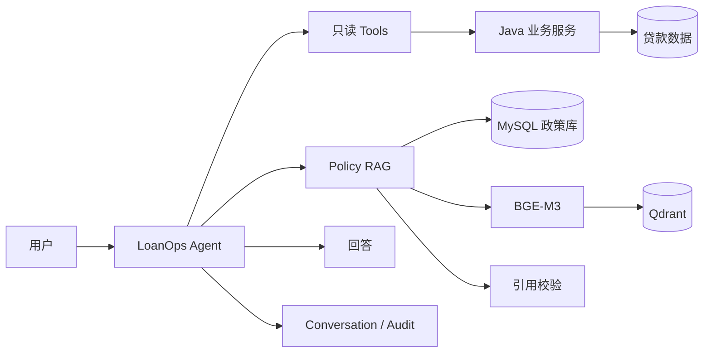

# LoanOps Agent：面向贷后运营的可审计智能 Agent

LoanOps Agent 是一个基于 **Java 21 / Spring Boot 3.4.5 / Spring AI 1.1.1** 开发的贷后运营智能 Agent。

它想解决一个很具体的问题：传统接口可以返回应还金额、已还金额、到期日等字段，但当用户继续问“为什么逾期”“现在还欠多少”“按照规定应该怎么处理”时，还需要把多项业务数据和政策条款串起来理解。

这个项目给这些查询提供一个自然语言入口，但不会把金融计算直接交给大模型：

> **Java 后端负责算清楚金额、日期和贷款状态；Agent 负责理解问题、选择查询工具、检索政策并把结果解释给人。**

当前项目已经支持 Tool Calling、多轮对话、Policy RAG、政策引用校验、执行审计、SSE 流式响应，以及 DeepSeek、Ollama / Qwen、GLM 三种 Chat Model。

> 仓库中的贷款数据和政策语料都是人为构造的演示数据，只用于工程验证，不代表真实银行业务数据、内部制度或监管政策。

## 实际能做什么

下面是一组真实手工测试，可以比技术名词更直观地说明这个 Agent 在做什么。

### 1. 查询为什么逾期

```text
You: LN-10002 为什么逾期？

Agent:
应还金额：8500.00
已还金额：5000.00
当前欠款金额：3500.00
还款日：2026-08-20
业务日期：2026-09-10
逾期天数：21 天
```

这里的大模型没有自己计算金额和逾期天数，而是调用只读 Tool，从 Java 业务服务取得结果。

### 2. 继续问“按照规定怎么办”

```text
You: 按照规定现在应该怎么处理？

Agent:
[P1] 贷款发生逾期后，应当依法采取催收、协议重组、
     债权转让或者核销等方式进行处置。

[P2] 逾期天数是风险分类的重要参考，但不得仅以逾期天数
     替代对偿债能力的综合判断。

结合当前欠款 3500.00、逾期 21 天的业务事实……
```

这一步会先判断问题是否需要政策依据，需要时再从 Policy RAG 中检索相关条款，并把引用写成 `[P1]`、`[P2]`。

### 3. 多轮追问

```text
You: 那他现在还欠多少钱？

Agent:
LN-10002 当前期剩余欠款为 3500.00。
```

Agent 能理解“他”仍然指前面讨论的 `LN-10002`。但涉及当前贷款状态时，不会直接相信上一轮回答，而是重新调用 Tool 查询当前数据。

### 4. 继续追问政策条款

```text
You: 这个规定具体是哪一条？

Agent:
[P1]《贷后管理评测规程》2026 版第四十四条
[P2]《金融资产风险分类评测规程》2026 版第十二条
```

这组对话串起了项目最核心的能力：**业务查询、连续对话、政策检索和引用校验**。

## 这个 Agent 和“直接把数据丢给大模型”有什么区别

| 关注点 | LoanOps Agent 的做法 |
|---|---|
| 金额和逾期天数谁来算 | Java Service 计算，大模型只负责解释 |
| 上一轮回答能不能当最新事实 | 不能。需要当前状态时重新查询 Tool |
| 政策依据从哪里来 | 政策原文和版本信息保存在 MySQL，Qdrant 负责帮助检索相关条款 |
| 找不到政策怎么办 | 明确返回无法确认，不让模型自己编一条规定 |
| 引用会不会乱写 | `[P1]`、`[P2]` 在服务端校验，必须对应真实检索证据 |
| Agent 能不能改贷款状态 | 不能，当前 Tool 全部只读 |
| 出问题后能不能追查 | 可以查询 Agent、Tool 和 Policy Retrieval 的审计记录 |

## 核心设计

### 金融计算为什么不用 LLM

应还金额、已还金额、逾期天数都有明确业务规则。如果把这些公式写进 Prompt，同一个问题可能因为模型或上下文变化得到不同结果，也很难做稳定测试。

因此项目把金融规则固定在 Java 领域服务里，金额使用 `BigDecimal`，业务日期通过可注入 `Clock` 获取。普通 REST / Service 测试可以完全绕过 AI 验证这些结果。

### 为什么政策原文放 MySQL，Qdrant 只负责检索

Qdrant 的作用是帮助 Agent 快速找到可能相关的条款，但它不是政策原文的最终依据。

政策正文、版本、生效时间和条款结构保存在 MySQL；Qdrant 保存由这些数据生成的向量索引。即使向量索引丢失，也可以通过 MySQL + BGE-M3 重新生成。

简单说就是：

> **MySQL 保存政策事实，Qdrant 帮忙找条款。**

### 为什么多轮对话不能替代重新查数据库

Conversation 只解决“他”“这笔贷款”“这个规定”分别指什么。

如果用户继续问余额、逾期天数等当前状态，Agent 仍会重新调用 Tool 获取数据，而不是把历史 Assistant 文本当数据库使用。

### 为什么 Agent 只读

当前三个 Tool 只查询：

- 当前应还情况；
- 逾期原因；
- 整笔贷款是否结清。

项目没有让 Agent 修改贷款、还款计划或付款记录。金融写操作会额外涉及权限、审批、确认、幂等、补偿和人工复核，不适合在当前项目里为了“功能更多”强行加入。

## 系统架构



更完整的请求链路、并发提交、Streaming 和失败处理见 [系统架构](docs/ARCHITECTURE.md)。

## 技术栈

| 层次 | 技术 |
|---|---|
| 后端 | Java 21、Spring Boot 3.4.5、Spring AI 1.1.1 |
| 数据访问 | MyBatis-Plus、Flyway |
| 业务数据库 | MySQL 8 / H2 |
| 向量检索 | Qdrant |
| Embedding | Ollama / BGE-M3 |
| Chat Model | DeepSeek、Ollama / qwen3:4b、GLM / glm-5.2 |
| Agent 能力 | Tool Calling、多轮 Conversation、Policy RAG、Citation Validation |
| 接口 | REST + SSE |
| 可观测性 | Agent / Tool / Policy Audit、Micrometer / Actuator |

## 快速体验

完整步骤见 [本地运行与验收手册](docs/RUNBOOK.md)。下面只保留最快路径。

### 1. 启动 MySQL 和 Qdrant

```powershell
docker compose up -d mysql qdrant
```

### 2. 准备政策 Embedding 模型

```powershell
ollama pull bge-m3
```

### 3. 初始化本地 Demo Policy

```powershell
./scripts/bootstrap-local-policy.ps1
```

### 4. 启动 Agent

DeepSeek：

```powershell
./scripts/run-agent.ps1 -Provider deepseek -WithPolicy
```

也可以使用：

```powershell
./scripts/run-agent.ps1 -Provider ollama -WithPolicy
./scripts/run-agent.ps1 -Provider glm -WithPolicy
```

### 5. 在另一个终端开始聊天

```powershell
./scripts/chat.ps1
```

可以依次尝试：

```text
LN-10002 为什么逾期？
按照规定现在应该怎么处理？
那他现在还欠多少钱？
这个规定具体是哪一条？
```

## 怎么证明它不是“只能演示一次”

项目没有只靠手工问几遍来判断 Agent 是否正确：

- Java 业务规则有确定性自动测试；
- DeepSeek、Ollama 和 GLM 共用同一套 6 个 Agent 测试用例；
- Policy RAG 使用固定的 30 个测试问题，检查是否找对条款、用对版本、正确处理无答案场景；
- 另有真实 Chat Model + MySQL + BGE-M3 + Qdrant 的端到端测试；
- 历史上出现过的模型错误和失败记录会保留，不用后续一次 PASS 覆盖。

详细方法见 [Agent 评测](docs/EVALUATION.md) 和 [Policy RAG 评测](docs/POLICY_RAG_EVALUATION.md)。固定测试集的结果只用于工程回归，**不代表真实金融生产环境准确率**。

## 项目边界

当前项目是可复现的工程验证项目，不是银行生产系统。

- 贷款和政策数据均为人为构造的演示数据；
- Agent 只有查询和解释能力，没有金融写权限；
- 没有实现完整的授信、放款、催收执行、罚息、提前还款等信贷业务；
- 没有实现生产级 RBAC、OAuth、限流、高可用或云部署；
- 没有为了堆技术栈引入 Multi-Agent、MCP、GraphRAG、Reranker 等当前没有明确需求和评测证据的组件。

完整范围见 [项目范围](docs/SCOPE.md)。

## 进一步了解

如果你想继续看实现细节：

- 想看系统为什么这样设计 → [系统架构](docs/ARCHITECTURE.md)
- 想看贷款金额、逾期和结清怎么算 → [贷款业务规则](docs/DOMAIN.md)
- 想在本地跑起来 → [本地运行与验收](docs/RUNBOOK.md)
- 想看三个模型怎么切换 → [模型 Provider](docs/PROVIDERS.md)
- 想看 Agent 怎么测试 → [Agent 评测](docs/EVALUATION.md)
- 想看 RAG 怎么测试 → [Policy RAG 评测](docs/POLICY_RAG_EVALUATION.md)
- 想看当前范围与限制 → [项目范围](docs/SCOPE.md)
- 想看完整文档地图 → [文档导航](docs/README.md)
