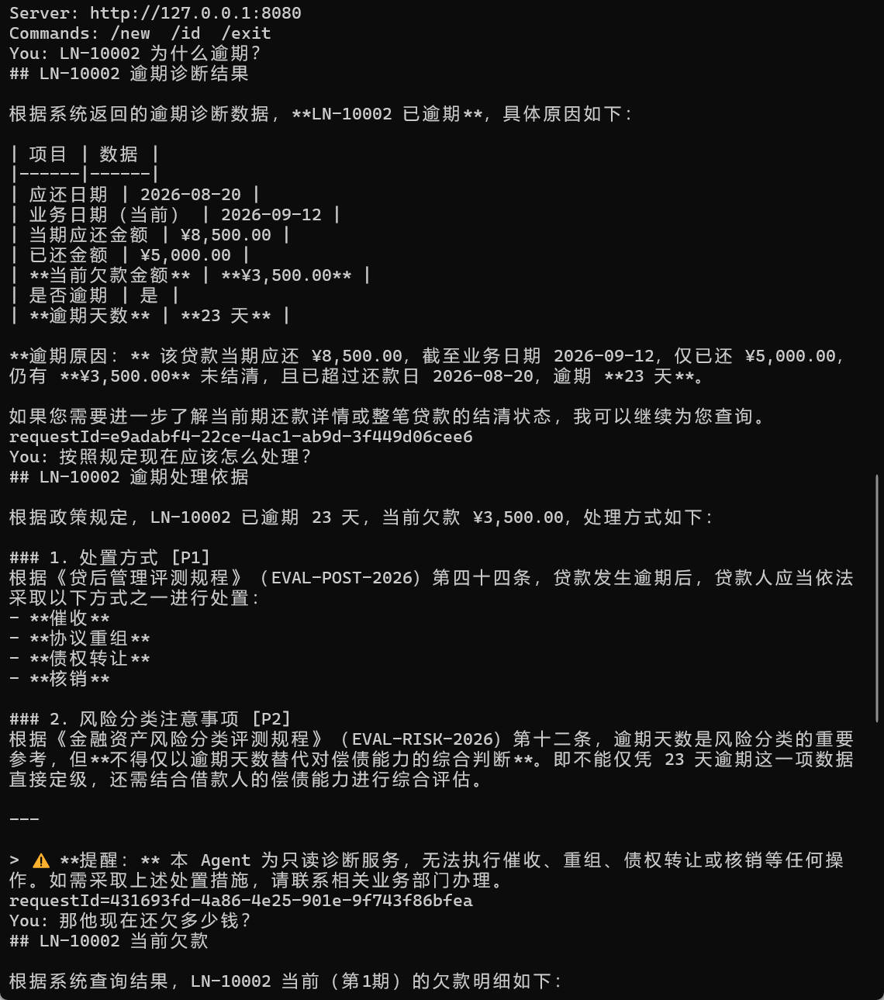
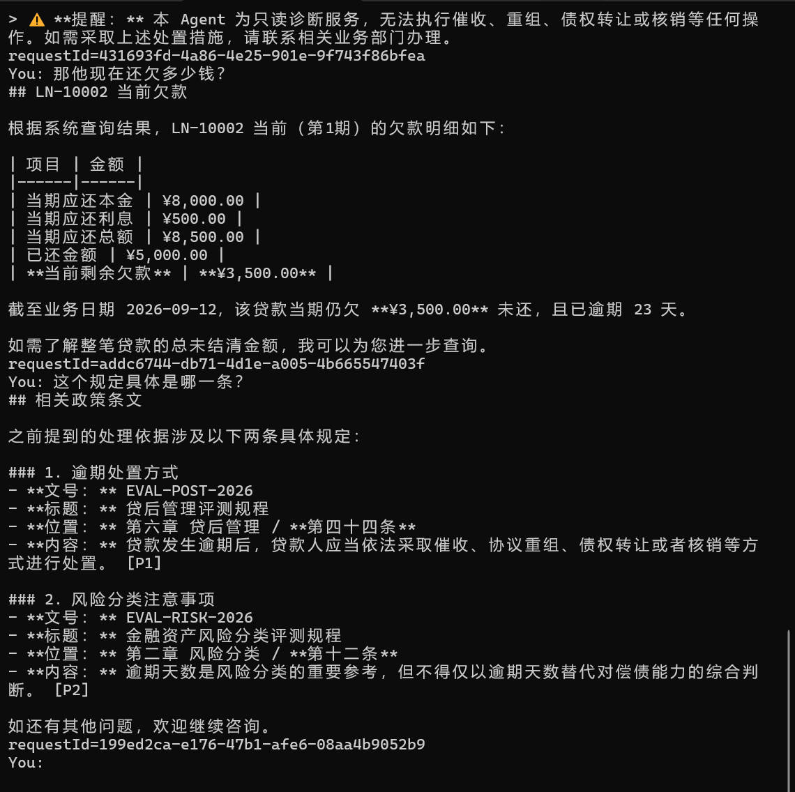
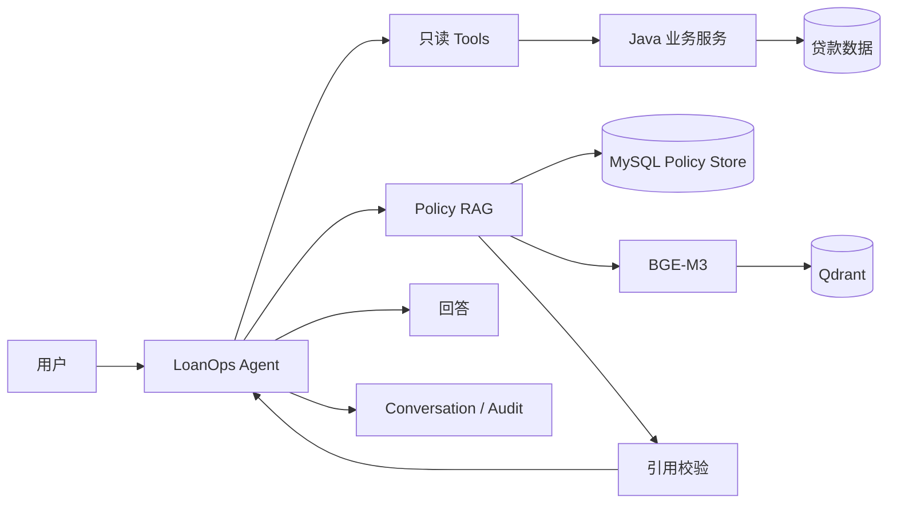

# LoanOps Agent：面向贷后运营的可审计智能 Agent 🤖

LoanOps Agent 是一个基于 **Java 21 / Spring Boot 3.4.5 / Spring AI 1.1.1** 开发的贷后运营智能 Agent 🤖。

它主要用于解决“为什么逾期、还欠多少钱、按照规定应该怎么处理”这类问题：

- 金融事实由确定性的 Java 后端服务计算，Agent 通过只读 Tool 查询；
- 政策依据从版本化政策知识库检索，并以 `[P1]`、`[P2]` 的形式给出引用；
- LLM 负责理解问题、选择 Tool 和组织回答，而不是自行计算金额、日期或贷款状态。

当前项目已经支持：

- Tool Calling；
- 多轮对话；
- Policy RAG；
- 政策引用校验；
- Agent / Tool / Policy Retrieval 审计；
- SSE 流式响应；
- DeepSeek、Ollama / Qwen、GLM 三种 Chat Model。

> 注意：仓库中的贷款数据和政策语料都是人为构造的演示数据，只用于工程验证，不代表真实银行业务数据、内部制度或监管政策。

---

## 实际能做什么

| 场景 | 示例 | 主要能力 |
|---|---|---|
| 贷款事实查询 | `LN-10002 为什么逾期？` | Tool Calling + Java 业务规则 |
| 多轮追问 | `那他现在还欠多少钱？` | 持久化 Conversation + fresh Tool query |
| 政策依据查询 | `按照规定现在应该怎么处理？` | Policy Router + RAG + Citation |
| 条款追问 | `这个规定具体是哪一条？` | Policy Evidence + `[P1]` / `[P2]` |

---

## 一组真实手工测试

下面这组对话可以比技术名词更直观地说明这个 Agent 在做什么。

### 1. 查询为什么逾期

```text
You: LN-10002 为什么逾期？

Agent:
应还金额：8500.00
已还金额：5000.00
当前欠款金额：3500.00
还款日：2026-08-20
业务日期：2026-09-10
逾期天数：21 天
```

这里的大模型没有自己计算金额和逾期天数，而是调用只读 Tool，从 Java 业务服务取得结果。

### 2. 继续问“按照规定怎么办”

```text
You: 按照规定现在应该怎么处理？

Agent:
[P1] 贷款发生逾期后，应当依法采取催收、协议重组、
     债权转让或者核销等方式进行处置。

[P2] 逾期天数是风险分类的重要参考，但不得仅以逾期天数
     替代对偿债能力的综合判断。

结合当前欠款 3500.00、逾期 21 天的业务事实……
```

系统会先判断当前问题是否需要政策依据；需要时再从 Policy RAG 中检索相关条款，并将引用组织为 `[P1]`、`[P2]`。

### 3. 多轮追问

```text
You: 那他现在还欠多少钱？

Agent:
LN-10002 当前期剩余欠款为 3500.00。
```

Agent 可以根据 Conversation 理解“他”仍然指前面讨论的 `LN-10002`。

但涉及当前贷款状态时，不会直接把上一轮 Assistant 文本当作最新事实，而是重新调用 Tool 查询当前数据。

### 4. 继续追问政策条款

```text
You: 这个规定具体是哪一条？

Agent:
[P1]《贷后管理评测规程》2026 版第四十四条
[P2]《金融资产风险分类评测规程》2026 版第十二条
```

这组对话串起了项目最核心的能力：

**业务查询 → 连续对话 → 政策检索 → 引用追溯。**

如图：

 

 

---

## 这个 Agent 和“直接把数据丢给大模型”有什么区别

| 关注点 | LoanOps Agent 的做法 |
|---|---|
| 金额和逾期天数谁来算 | Java Service 计算，大模型只负责理解和解释 |
| 上一轮回答能不能当最新事实 | 不能，需要当前状态时重新查询 Tool |
| 政策依据从哪里来 | 政策原文和版本信息保存在 MySQL，Qdrant 负责检索相关条款 |
| 找不到政策怎么办 | 明确返回无法确认，不让模型依靠自身参数知识编造规定 |
| 引用会不会乱写 | `[P1]`、`[P2]` 在服务端校验，必须对应真实检索证据 |
| Agent 能不能修改贷款状态 | 不能，当前三个 Tool 全部只读 |
| 出问题后能不能追查 | 可以关联 Agent、Tool 和 Policy Retrieval 审计记录 |

---

## 核心设计

### 1. 金融计算为什么不用 LLM

应还金额、已还金额、逾期天数和结清状态都有明确的业务规则。

如果把这些规则直接写进 Prompt，由模型自己推算：

- 相同数据可能因为模型或上下文变化得到不同结果；
- 金额、日期等确定性业务事实难以保证稳定；
- 业务规则无法像普通 Java 代码一样独立测试；
- 更换模型后还需要重新验证 Prompt 行为。

因此项目将金融规则固定在 Java 业务层：

```text
用户问题
  ↓
Agent 理解意图
  ↓
选择只读 Tool
  ↓
Java Service 计算确定性事实
  ↓
Agent 根据结果组织回答
```

金额使用 `BigDecimal` 计算，业务日期通过可注入 `Clock` 获取。

普通 Java / Spring 测试可以完全绕过 AI，对还款金额、逾期判断和结清状态进行独立验证。

### 2. 为什么贷款事实和 Policy RAG 分开

贷款事实和政策知识解决的是两类不同问题。

贷款业务服务回答：

> 现在发生了什么？

例如：

- 当前应还多少钱；
- 已经还了多少钱；
- 还欠多少钱；
- 是否逾期；
- 逾期多少天；
- 整笔贷款是否结清。

Policy RAG 回答：

> 按照当前适用规定应该如何理解？

例如：

- 发生逾期以后应如何处理；
- 风险分类应参考哪些规则；
- 当前结论具体依据哪一条政策。

因此两类事实来源分别建模、分别查询、分别审计，而不是全部拼进 Prompt 交给模型猜测。

### 3. 为什么政策原文放 MySQL，Qdrant 只负责检索

MySQL 保存：

- Policy 文档；
- Policy 版本；
- 生效和失效时间；
- 条款结构；
- chunk 原文和元数据。

它是 Policy 的事实来源。

Qdrant 保存的是通过 BGE-M3 生成的向量索引，用来帮助系统进行语义召回。

即使 Qdrant 中的索引全部丢失，也可以根据 MySQL 中的 Policy 数据重新生成。

简单说：

> **MySQL 保存政策事实，Qdrant 帮忙找条款。**

### 4. 为什么多轮对话不能替代重新查数据库

Conversation 主要解决上下文问题，比如：

- “他”指的是谁；
- “这笔贷款”指的是哪笔贷款；
- “这个规定”指的是上一轮哪条政策。

Conversation 本身不是业务事实源。

例如上一轮系统回答“还欠 3500 元”，之后完全可能又发生新的还款。

因此，如果用户继续询问余额、逾期天数等当前状态，Agent 仍然需要重新调用 Tool 获取最新数据，而不是直接复用上一轮 Assistant 文本。

### 5. 为什么 Agent 只读

当前三个 Tool 分别查询：

- 当前还款情况；
- 逾期诊断；
- 整笔贷款结清状态。

项目没有让 Agent 修改贷款、还款计划或付款记录。

原因是金融写操作会额外引入：

- 权限；
- 审批；
- 二次确认；
- 幂等；
- 事务；
- 失败补偿；
- 人工复核。

因此当前项目首先聚焦于：

> **可审计的只读诊断 Agent。**

---

## 技术能力

| 能力 | 当前实现 |
|---|---|
| 确定性金融事实 | Java Service 使用 `BigDecimal`、`LocalDate`、可注入 `Clock` 计算还款、逾期与结清事实 |
| 只读 Tool Calling | 3 个 Spring AI Tools：当前还款、逾期诊断、结清状态 |
| 持久化多轮会话 | USER / ASSISTANT transcript 持久化到 MySQL，支持上下文指代与并发安全提交 |
| Policy RAG | MySQL 版本化 Policy Store + BGE-M3 Embedding + Qdrant |
| 政策引用 | `[P1]`、`[P2]` 必须映射到真实检索证据，并通过确定性 Citation Validator |
| 多模型切换 | DeepSeek、Ollama / qwen3:4b、GLM / glm-5.2 |
| Audit | Agent、Tool、Policy Retrieval 均保留可关联审计记录 |
| 流式对话 | Terminal Chat 通过 SSE 接收响应；Policy 回答在引用校验和成功提交后再下发 |
| 可复现评测 | 固定 Agent baseline、30-case Policy RAG Gold Dataset、真实 Provider Hero E2E |
| 本地 Policy 初始化 | 显式、幂等、安全的 Demo Policy Bootstrap，不覆盖未知 Policy 数据 |

---

## 系统架构



系统遵循一个核心原则：

> **LLM 负责理解与编排，确定性系统负责事实。**

更完整的请求链路、并发提交、Streaming 语义和失败处理见：

[系统架构](docs/ARCHITECTURE.md)

---

## 技术栈

| 层次 | 技术 |
|---|---|
| 后端 | Java 21、Spring Boot 3.4.5、Spring AI 1.1.1 |
| 数据访问 | MyBatis-Plus、Flyway |
| 业务数据库 | MySQL 8 / H2 |
| 向量检索 | Qdrant |
| Embedding | Ollama / BGE-M3 |
| Chat Model | DeepSeek、Ollama / qwen3:4b、GLM / glm-5.2 |
| Agent 能力 | Tool Calling、多轮 Conversation、Policy RAG、Citation Validation |
| 接口 | REST + SSE |
| 可观测性 | Agent / Tool / Policy Audit、Micrometer / Actuator |
| 测试与评测 | JUnit、Spring Boot Test、真实 MySQL / Qdrant E2E、固定 Gold Dataset |

---

## 快速开始

完整说明见：

[本地运行与验收手册](docs/RUNBOOK.md)

下面只保留最快体验路径。

### 环境要求

- Java 21
- Maven 3.9+
- Docker
- Ollama
- PowerShell 7

### 1. 启动 MySQL 和 Qdrant

```powershell
docker compose up -d mysql qdrant
docker compose ps
```

### 2. 准备 Policy Embedding 模型

```powershell
ollama pull bge-m3
```

### 3. 初始化本地 Demo Policy

```powershell
./scripts/bootstrap-local-policy.ps1
```

成功时会看到类似：

```text
LOCAL_POLICY_BOOTSTRAP_SUCCESS documents=4 versions=5 chunks=41 indexed=41
```

Bootstrap 可以安全重复执行；如果检测到未知或非 Demo Policy 数据，会在写入和索引重建前拒绝执行。

### 4. 启动 Agent

使用 DeepSeek：

```powershell
./scripts/run-agent.ps1 -Provider deepseek -WithPolicy
```

也可以使用：

```powershell
./scripts/run-agent.ps1 -Provider ollama -WithPolicy
./scripts/run-agent.ps1 -Provider glm -WithPolicy
```

DeepSeek / GLM 的 API Key 可以配置在仓库根目录本地 `.env` 中，参考 `.env.example`。

### 5. 开始聊天

在另一个 PowerShell 终端：

```powershell
./scripts/chat.ps1
```

可以依次尝试：

```text
LN-10002 为什么逾期？
按照规定现在应该怎么处理？
那他现在还欠多少钱？
这个规定具体是哪一条？
```

Terminal 支持：

```text
/new    开始新的客户端会话
/id     查看当前 conversationId
/exit   退出
```

---

## 评测与验证

项目不依赖“手工问几遍感觉不错”来判断 Agent 是否正确。

当前分别维护：

- Java / Spring 的确定性自动测试；
- 6 个跨模型统一的 Agent 基线测试用例；
- 30 个 Policy RAG 黄金测试用例；
- Policy Router 专项回归测试；
- 基于真实 Chat Model、MySQL、BGE-M3 和 Qdrant 的端到端验收；
- 对抗测试与引用校验失败案例。

其中：

- Java 业务规则测试负责验证金额、逾期和结清逻辑；
- Agent baseline 用于检查不同 Chat Model 下的核心 Tool Calling 行为；
- Policy RAG Gold Dataset 用于检查路由、检索、条款版本和无答案问题；
- 真实 Provider E2E 用于验证模型、数据库、Embedding 和向量数据库整体链路。

固定 Policy RAG E2 数据集上的核心指标当前为：

| 指标 | E2 |
|---|---:|
| Router Accuracy | 1.0000 |
| Policy-required Recall | 1.0000 |
| Exact Reference Accuracy | 1.0000 |
| No Match Accuracy | 1.0000 |
| Recall@1 / @3 / @5 | 1.0000 |
| MRR | 1.0000 |
| False Match | 0 |

这些数字**只适用于仓库内固定 synthetic corpus 和 Gold Dataset，不代表真实金融生产环境准确率**。

详细方法与历史失败案例见：

- [Agent 评测](docs/EVALUATION.md)
- [Policy RAG 评测](docs/POLICY_RAG_EVALUATION.md)
- [当前验收标准](docs/ACCEPTANCE.md)
- [最近一次验收快照](docs/ACCEPTANCE_SNAPSHOT.md)

---

## 项目结构

```text
loanops-agent/
├── src/main/java/com/loanops/
│   ├── agent/          Agent 编排与模型调用
│   ├── conversation/   多轮会话持久化
│   ├── policy/         Policy RAG、引用与政策审计
│   ├── service/        贷款业务规则与查询
│   └── tool/           Spring AI 只读 Tools
│
├── src/main/resources/
│   ├── db/migration/   Flyway 数据库迁移
│   └── policy/         Demo Policy corpus
│
├── evaluation/         固定评测集与评测证据
├── scripts/            启动、验证和评测脚本
└── docs/               架构、运行、范围和评测文档
```

---

## 项目边界

当前项目是**可复现的工程验证项目**，不是银行生产系统。

目前明确：

- 贷款数据和政策语料均为人为构造、用于演示和测试的数据；
- Agent 只有查询和解释能力，没有金融写权限；
- 未实现完整的客户、授信、放款、催收执行、罚息、提前还款等信贷业务；
- 未实现生产级 RBAC、OAuth、限流、高可用、云部署或 Secrets Manager；
- 固定评测集用于工程回归，不代表真实金融生产场景准确率；
- 未引入 Multi-Agent、MCP、GraphRAG、Reranker 等没有当前需求或评测证据的组件。

完整范围见：

[项目范围](docs/SCOPE.md)

---

## 进一步了解

如果想继续看实现细节：

- 想看系统为什么这样设计 → [系统架构](docs/ARCHITECTURE.md)
- 想看贷款金额、逾期和结清怎么算 → [贷款业务规则](docs/DOMAIN.md)
- 想在本地跑起来 → [本地运行与验收](docs/RUNBOOK.md)
- 想看三个模型怎么切换 → [模型 Provider](docs/PROVIDERS.md)
- 想看 Agent 怎么测试 → [Agent 评测](docs/EVALUATION.md)
- 想看 RAG 怎么测试 → [Policy RAG 评测](docs/POLICY_RAG_EVALUATION.md)
- 想看当前范围与限制 → [项目范围](docs/SCOPE.md)
- 想看完整文档地图 → [文档导航](docs/README.md)