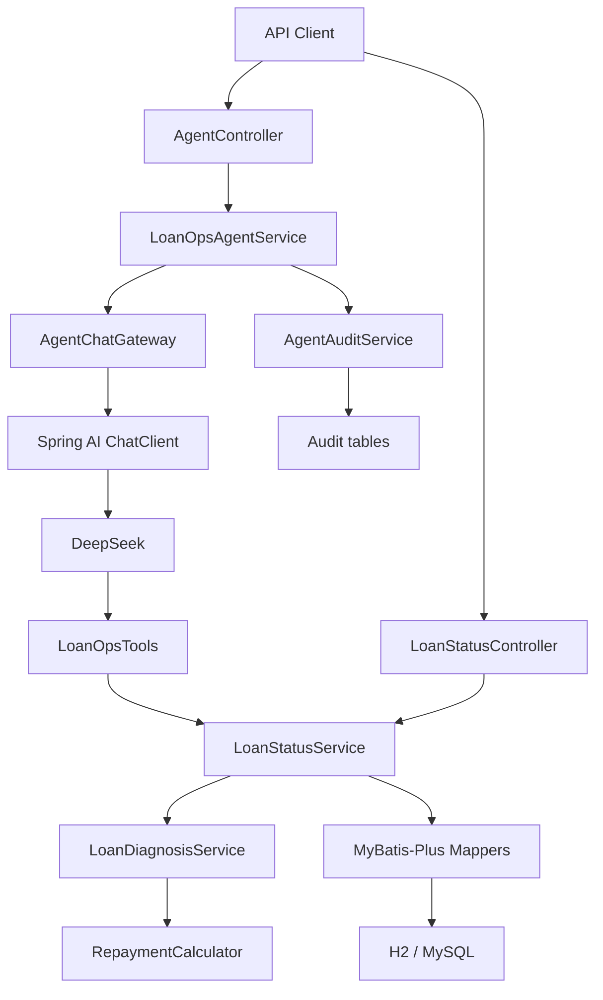

# LoanOps Agent

一个用 Java 计算贷款还款事实、用 Spring AI + DeepSeek 做自然语言查询的只读贷后诊断 Demo。

项目刻意把 LLM 放在业务规则之外：金额、逾期天数、结清状态都由 Java 计算；模型只负责理解问题、选择 Tool 和组织回答。这样即使以后换模型，贷款事实也不应该跟着变化。

## 已实现

- H2 作为默认开发/测试数据库，MySQL 8.0 作为可选运行 Profile；两者共用 MyBatis-Plus 和 Flyway 迁移；
- `BigDecimal` 金额计算和可注入 `Clock`；
- `GET /api/loans/{loanNo}/status` 确定性查询接口；
- 3 个只读 Tool：`getCurrentRepayment`、`getOverdueDiagnosis`、`getSettlementStatus`；
- `POST /api/agent/chat` 自然语言查询；
- DeepSeek Tool Calling 已做真实 E2E 验证；
- Maven 自动测试、GitHub Actions 和一键验收脚本。

## 本地启动

### 环境

- JDK 21
- Maven 3.9+

先确认当前终端使用的是 Java 21：

```powershell
java -version
mvn -version
```

### 1. 先跑普通 REST

不启用 AI，也不需要 API Key：

```powershell
# 8080 被占用时可以换端口；下面统一用 18080 演示
$env:SERVER_PORT = "18080"

mvn spring-boot:run
```

另开一个 PowerShell：

```powershell
Invoke-RestMethod `
  -Method Get `
  -Uri "http://localhost:18080/api/loans/LN-10002/status" |
  ConvertTo-Json -Depth 10
```

固定测试数据下，`LN-10002` 的核心结果是：应还 `8500`、已还 `5000`、剩余 `3500`。

### 2. 再启用 Agent

PowerShell 下不要使用未加引号的 `-Dspring-boot.run.profiles=ai`。最稳妥的方式是直接设置 Spring Profile 环境变量：

```powershell
$env:SERVER_PORT = "18080"
$env:SPRING_PROFILES_ACTIVE = "ai"
$env:DEEPSEEK_API_KEY = "your-key"
$env:DEEPSEEK_MODEL = "deepseek-chat"

mvn spring-boot:run
```

API Key 只通过环境变量传入，不要写进 `application.yml` 或提交到 Git。

请求 Agent：

```powershell
$body = @{
    message = "LN-10002 为什么逾期？"
} | ConvertTo-Json

Invoke-RestMethod `
    -Method Post `
    -Uri "http://localhost:18080/api/agent/chat" `
    -ContentType "application/json; charset=utf-8" `
    -Body ([System.Text.Encoding]::UTF8.GetBytes($body)) |
    ConvertTo-Json -Depth 10
```

一次真实调用中，Agent 会选择 `getOverdueDiagnosis`，再基于 Java 返回的 `8500 / 5000 / 3500 / 3 天`组织解释。

如果 Java 访问模型 API 需要本机代理，见 [Demo 文档](docs/DEMO.md) 中的 JVM 代理说明。

## MySQL + Flyway

默认启动仍使用内存 H2，方便快速开发和测试。需要验证真实 MySQL 路径时，用 Docker Compose 启动 MySQL 8.0：

```powershell
docker compose up -d mysql

$env:SPRING_PROFILES_ACTIVE = "mysql"
$env:SERVER_PORT = "18080"

mvn spring-boot:run
```

默认连接 `127.0.0.1:3307/loanops`。本地账号配置见 `.env.example`，可以用同名环境变量覆盖。

数据库结构不再由 `schema.sql` / `data.sql` 隐式初始化，而是由 Flyway 版本化管理：

```text
V1__create_loan_schema.sql   # 建表、唯一约束、外键
V2__seed_demo_data.sql       # LN-10001 / 10002 / 10003 演示数据
V3__create_agent_audit_tables.sql # Agent 请求与 Tool 审计表
```

启动时 Flyway 会先校验并执行未应用的 migration，再由 MyBatis-Plus 访问数据库。重复启动时不会重复执行已经成功的版本。

一键验证真实 MySQL 路径：

```powershell
.\scripts\verify-mysql.ps1
```

脚本会启动 MySQL、在 `mysql` Profile 下跑完整测试、启动实际 JAR、检查 `LN-10002` 的 REST 结果，并核对 `flyway_schema_history`。

`mysql` Profile 当前用于本地 Demo / 集成测试；其中 `useSSL=false` 和默认开发密码不是生产环境配置。

## Agent 审计与可观测性

Agent Audit 与运行时 Observability 分开：审计写入 Flyway V3 创建的
`agent_audit_log` / `agent_tool_audit_log`，用于按 request id 追溯请求和 Tool 顺序；
Micrometer、Actuator 和 Spring AI observations 负责运行时指标与框架观测。

默认 `loanops.audit.include-content=false`，只保存 message/answer 的长度和 SHA-256 指纹，
不保存完整原文。SHA-256 只是完整性/关联指纹，不是匿名化；明确开启配置才保存原文。
Spring AI prompt、completion、Tool arguments 和 Tool results 默认不导出到 observations。

`POST /api/agent/chat` 的 request id 由 Servlet Filter 在 Controller 和 JSON 反序列化之前生成，并写入 `X-Request-Id`、request attribute 与 MDC。
因此 malformed JSON 也能拿到 transport correlation id；客户端传入的 `X-Request-Id` 不会被信任，服务端始终生成自己的 UUID。只有成功解析为 Agent message 的请求才创建 Agent Audit。
空白 message 会先写入 `STARTED`，再以 `FAILED / InvalidAgentMessageException` 结束，且不会调用模型。

Audit 对原始 message 计算长度和 SHA-256，不会在进入 ChatClient 前偷偷 `trim`。Micrometer tag 只接受有限的 outcome / Tool / audit-operation 值，其他值统一归为 `unknown`，避免 requestId、loanNo 等高基数字段进入时序指标。

响应中的 `X-Request-Id` 可以直接用于查询本次 Agent 审计：

```text
GET /api/agent/audits/{requestId}
GET /actuator/health
GET /actuator/info
GET /actuator/prometheus
```

审计查询是当前无 RBAC 的本地 Demo/验收接口，生产环境不能裸露。审计状态只表达技术结果
`STARTED` / `SUCCESS` / `FAILED`，不会从自然语言回答猜测业务拒绝结论。
## 架构



依赖方向只有一条：Agent / Tool 可以调用业务服务，但不能直接访问 Mapper，也不能重新实现贷款计算。

更完整的分层和扩展说明见 [docs/ARCHITECTURE.md](docs/ARCHITECTURE.md)。

## 三个固定案例

| 贷款 | 场景 | 预期结果 |
|---|---|---|
| `LN-10001` | 本期应该还多少钱 | 应还 `8500`，未逾期 |
| `LN-10002` | 为什么逾期 | 剩余 `3500`，在业务日 `2026-08-23` 时逾期 `3` 天 |
| `LN-10003` | 是否已经结清 | `settled=true`，未偿金额 `0` |

这些数据由 Flyway 的 `V2__seed_demo_data.sql` 写入，只用于 Demo 和测试，不代表真实银行完整业务规则。

## 业务规则放在哪里

确定性规则只在 Java Domain / Service 中实现。例如：

```text
dueAmount        = principalDue + interestDue
paidAmount       = sum(payment records for the repayment plan)
outstandingAmount = max(dueAmount - paidAmount, 0)
overdue          = outstandingAmount > 0 && asOfDate > dueDate
```

Tool 不计算金额，只调用已有服务；Prompt 里也不复制这些公式。

## 测试和可复现验收

普通测试：

```powershell
mvn clean verify
```

测试覆盖 Domain、数据库约束、REST、Tool、Agent、审计和 Observability；请以当前工作树实际执行的
`mvn clean verify` 结果为准。

一键跑固定业务案例：

```powershell
.\scripts\verify-resume-mvp.ps1
```

连真实 DeepSeek 一起验证：

```powershell
$env:DEEPSEEK_API_KEY = "your-key"
.\scripts\verify-resume-mvp.ps1 -WithAi
```

如果 JVM 需要走本机 `127.0.0.1:7890` 代理：

```powershell
.\scripts\verify-resume-mvp.ps1 `
  -WithAi `
  -ProxyHost 127.0.0.1 `
  -ProxyPort 7890
```

验收脚本除了检查三个业务案例，还会检查真实 Tool Calling、未知贷款不编造结果，以及写请求不会改变贷款状态。

## Provider

当前只把 **DeepSeek** 标记为已验证。Qwen 和 GLM 还没有完成真实接入与 E2E，因此 README 不宣称已经支持它们。

Provider 设计边界和后续接入方式见 [docs/PROVIDERS.md](docs/PROVIDERS.md)。

## 当前边界

这是一个小型贷后诊断项目，不是贷款核心系统。目前没有实现授信审批、评分、放款、催收、罚息、提前还款、RBAC、RAG、MCP 或写操作 Tool。

这样做是有意的：先把“数据库事实 -> Java 计算 -> Tool -> LLM 解释”这一条链路做完整，再决定是否扩展业务范围。

## 主要代码

```text
src/main/java/com/loanops/
├── agent/          # Agent HTTP 入口和 ChatClient 调用
├── controller/     # 确定性 REST
├── domain/         # 贷款领域对象
├── persistence/    # MyBatis-Plus Entity / Mapper
├── service/        # 确定性业务计算和查询编排
└── tool/           # Spring AI 只读 Tools
```

更详细的规则、验收和演示步骤：

- [领域规则](docs/DOMAIN.md)
- [架构说明](docs/ARCHITECTURE.md)
- [Demo](docs/DEMO.md)
- [Provider 边界](docs/PROVIDERS.md)
- [验收快照](docs/ACCEPTANCE_SNAPSHOT.md)
