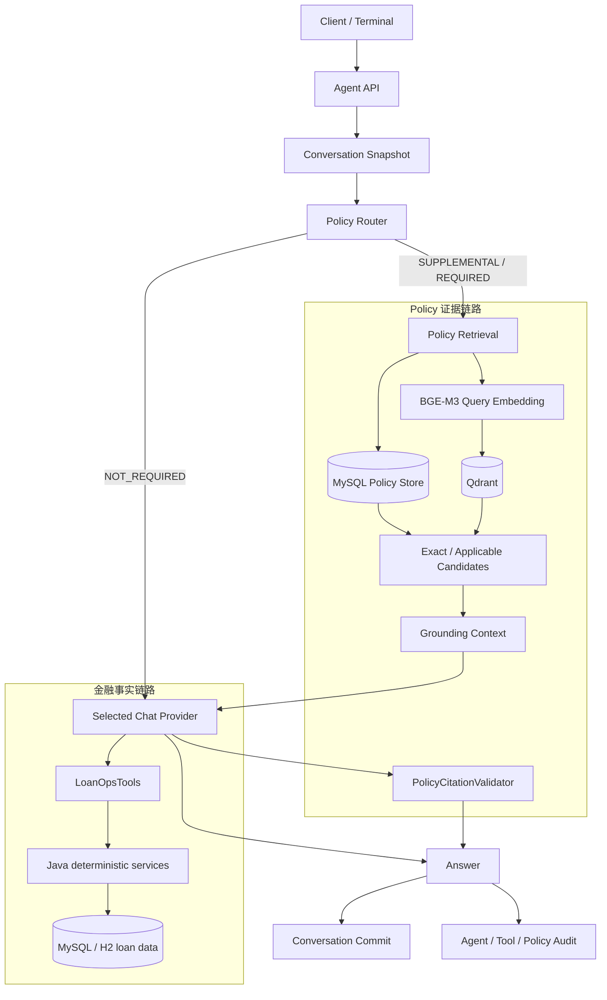

# LoanOps Agent 系统架构

## 1. 设计目标

LoanOps Agent 的核心不是让 LLM 直接“懂贷款业务”，而是把不同类型的事实放到各自可验证的系统中：

- Java 领域服务负责金额、日期、逾期与结清等确定性金融事实；
- MySQL 保存版本化 Policy 文档、版本、适用期和 chunk，是 Policy 的事实来源；
- Qdrant 保存由 MySQL + BGE-M3 重建的派生向量索引；
- LLM 负责自然语言理解、Tool 选择和基于受控证据组织回答；
- Conversation 提供上下文，不替代当前业务事实查询；
- Citation Validator 和 Audit 提供独立于模型自律的确定性边界。

这套设计遵循：

> **LLM 负责理解与编排，确定性系统负责事实。**

普通 REST / Service 测试可以绕过 AI 独立验证贷款事实。Policy RAG 不能修改贷款数据，历史 Conversation 也不能替代 fresh Tool query。

## 2. 总体请求流程



运行时由 Agent orchestration 负责：

1. 校验当前输入；
2. 创建或读取 Conversation Snapshot；
3. 写入 Agent Audit `STARTED`；
4. Policy Router 判断 `NOT_REQUIRED / SUPPLEMENTAL / REQUIRED`；
5. 必要时构造 Policy Query、检索适用版本并建立 Grounding Context；
6. 将历史、Policy 上下文、当前问题与只读 Tools 交给当前 Chat Provider；
7. 需要 Policy 时校验 `[Pn]` 引用；
8. 成功后原子追加 USER / ASSISTANT transcript，并完成 Agent Audit。

Provider、Tool、必要 Policy 检索、Citation 或 Conversation commit 失败，都不能留下“伪成功 turn”。

## 3. 金融事实链路

```text
Chat Provider
  -> LoanOpsTools
  -> LoanStatusService / LoanDiagnosisService
  -> RepaymentCalculator
  -> MySQL / H2 loan data
```

核心约束：

- 金额使用 `BigDecimal`；
- 业务日期使用可注入 `Clock`；
- Tool 只委托已有 Service，不重新实现业务公式；
- Prompt 不包含贷款金额计算算法；
- 当前事实必须通过当前数据库 + Tool 获得，不能从旧 Assistant 文本推断。

当前三个只读 Tool：

```text
getCurrentRepayment
getOverdueDiagnosis
getSettlementStatus
```

如果 REST / Service 与 Agent 自然语言出现冲突，优先检查 Java 事实和 Tool Audit，而不是修改业务规则去迎合模型输出。

完整业务规则见 [DOMAIN.md](DOMAIN.md)。

## 4. Policy RAG 链路

```text
Policy Router
  -> Policy Query
  -> MySQL applicable versions / chunks
       -> exact-reference candidates
  -> BGE-M3 query embedding
       -> Qdrant semantic candidates
  -> merge / rank / applicability filtering
  -> Grounding Context
  -> Chat Provider
  -> PolicyCitationValidator
  -> Answer
```

### Router

Policy Router 将问题分为：

- `NOT_REQUIRED`：纯金融事实问题，不运行 Policy Retrieval；
- `SUPPLEMENTAL`：需要组合贷款事实和 Policy Evidence；
- `REQUIRED`：纯 Policy 问题必须取得足够证据，否则明确 no-match / fail closed。

### MySQL 与 Qdrant 的职责

PolicyIngestion 写入规范化文本、内容 hash、版本有效期和结构化 chunks。

PolicyIndexRebuilder 从 MySQL 读取可索引 chunks，经 BGE-M3 生成 Embedding 后重建 Qdrant collection。

因此：

```text
MySQL  = Policy 事实来源
Qdrant = 可重建的派生向量索引
```

Qdrant 命中只有能映射回适用的 MySQL chunk，才允许进入 Grounding Context。

### Policy Context 不是系统指令

检索到的 Policy 文本属于不可信外部证据，不是 system instruction。

当回答需要 Policy Citation 时，`PolicyCitationValidator` 会拒绝缺失或未知 `[Pn]` 的回答，而不是只依赖 Prompt 要求模型“记得引用”。

## 5. 持久化多轮会话

Conversation 使用 MySQL 的 `conversation` 与 `conversation_message` 保存成功 transcript。

约束：

- 只持久化成功的 USER / ASSISTANT；
- Tool message 和 Policy Context 不进入 transcript；
- Conversation 用于指代消解，不作为当前金融事实来源；
- 模型可见历史有消息数和字符数上限；
- append 使用 optimistic CAS，避免并发 turn 相互覆盖；
- transcript append 与 Agent SUCCESS audit 在完成事务中一起提交。

例如：

```text
USER: LN-10002 为什么逾期？
ASSISTANT: ...

USER: 那他现在还欠多少钱？
```

第二轮可以从历史识别 `LN-10002`，但仍需要重新调用只读 Tool 查询当前数据。

## 6. SSE 流式响应

项目保留同步：

```http
POST /api/agent/chat
```

同时提供：

```http
POST /api/agent/chat/stream
```

两条路径共用同一 Agent、Provider、Tool、Policy 与 Conversation 逻辑，不存在第二套业务实现。

SSE 事件：

```text
start
delta
done
error
```

### 非 Policy 回答

`NOT_REQUIRED` turn 可以把模型 chunk 作为 provisional `delta` 增量输出，同时服务端聚合完整 answer。

### Policy 回答

`SUPPLEMENTAL / REQUIRED` 为了保证 Citation 和成功提交边界，会先在服务端完成 Policy Citation Validation 与 successful-turn commit，再下发最终安全回答。

因此项目不宣称“所有回答都 token streaming”。

### 成功语义

客户端只有收到：

```text
done
committed=true
```

才能把该 turn 视为服务端正式提交。

在 `done` 之前显示的 `delta` 都是 provisional。

## 7. Audit 与可观测性

Audit 分为：

- **Agent Audit**：request、conversation、provider/model、SUCCESS/FAILED、history/system-prompt fingerprint；
- **Tool Audit**：Tool 名称、loan number、调用顺序、耗时与结果；
- **Policy Audit**：decision、retrieval status、as-of date、query/context/config hash、Embedding model、collection、hits、citation；
- **Observability**：Micrometer / Actuator health、metrics、Prometheus。

默认 Audit 更关注结构化元数据、长度和 SHA-256 fingerprint，而不是无边界保存 Prompt / Answer 原文。

当前 Audit 查询接口用于本地验证，没有 RBAC，不应直接作为生产接口暴露。

## 8. 数据与迁移

Flyway 是数据库结构的版本来源。

| Migration | 主要职责 |
|---|---|
| V1 | loan_contract、repayment_plan、payment_record |
| V2 | LN-10001 / LN-10002 / LN-10003 synthetic fixture |
| V3 | Agent / Tool Audit |
| V4 | Conversation Runtime |
| V5 | Policy document / version / chunk |
| V6 | Policy Retrieval / Hit Audit |

H2 用于快速 deterministic tests；MySQL 8 用于本地集成、Policy RAG 和真实 Hero E2E。

所有 loan fixture 与 Demo Policy 都是 synthetic validation data。

## 9. 失败与安全边界

当前运行时约束：

```text
current message      <= 4,000 characters
model-visible history <= 20 messages / 12,000 characters
HTTP connect timeout  = 5s
HTTP read timeout     = 60s
Spring AI max-attempts = 1
```

同时保持以下原则：

- history 截断不切断完整 turn；
- 外部调用失败不会被无限重试隐藏；
- `REQUIRED + NO_MATCH` 不调用模型编造 Policy；
- required-policy retrieval 失败不能伪装成成功；
- supplemental-policy 失败不能覆盖已经取得的金融事实；
- missing / invalid citation 不能进入成功 transcript；
- Agent 没有写 Tool；
- Conversation commit 冲突失败，而不是覆盖并发更新。

## 10. 有意保留的简单性

当前没有因为“Agent 项目应该功能多”而默认加入：

- Multi-Agent；
- MCP；
- Redis long-term memory；
- Hybrid Search / BM25 / RRF / Reranker；
- GraphRAG / HyDE；
- 写操作 Tool。

是否引入新组件，应由明确需求和评测证据驱动，而不是为了堆技术名词。

当前范围见 [SCOPE.md](SCOPE.md)。
