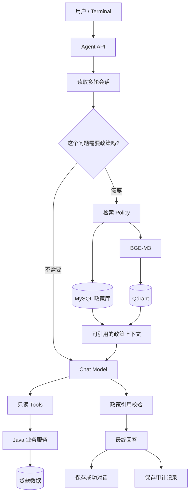

# LoanOps Agent 系统架构

## 1. 先说结论

LoanOps Agent 的核心设计不是“让大模型学会贷款业务”，而是把不同类型的事实交给更适合的系统处理：

- 金额、日期、逾期和结清由 Java 业务服务计算；
- 大模型负责理解问题、选择 Tool 和组织回答；
- 政策原文、版本和生效时间保存在 MySQL；
- Qdrant 只负责帮助找到相关政策条款；
- 多轮 Conversation 负责理解“他”“这笔贷款”“这个规定”指什么，但不替代重新查询当前业务数据；
- 引用校验和 Audit 用来检查模型最终用了哪些数据和政策依据。

可以把它概括为：

> **LLM 负责理解和编排，确定性系统负责事实。**

## 2. 一次请求是怎么走的



运行时大致经历：

1. 检查用户输入是否合法；
2. 创建或读取 Conversation；
3. 判断问题是否需要 Policy RAG；
4. 如果需要政策，先构造查询并找到当前业务日期下适用的条款；
5. 把多轮上下文、政策证据、当前问题和只读 Tools 交给 Chat Model；
6. 如果回答用了政策，再检查 `[P1]`、`[P2]` 是否真的对应本次检索结果；
7. 全部成功后，才把 USER / ASSISTANT 两条消息保存到 Conversation，并完成 Audit。

如果模型、Tool、必要的政策检索、引用校验或最终保存失败，这一轮不会被记录成“成功对话”。

## 3. 金融事实：为什么一定经过 Java Service

调用链：

```text
Chat Model
  -> LoanOpsTools
  -> LoanStatusService / LoanDiagnosisService
  -> RepaymentCalculator
  -> MySQL / H2
```

当前三个 Tool：

```text
getCurrentRepayment
getOverdueDiagnosis
getSettlementStatus
```

它们只做查询和转发，不在 Tool 里重新实现业务公式。

业务规则包括：

- 金额使用 `BigDecimal`；
- 业务日期通过可注入 `Clock` 获取；
- Prompt 不负责计算贷款金额；
- 当前状态必须来自当前数据库和 Tool，而不是历史 Assistant 文本。

例如用户先问：

```text
LN-10002 为什么逾期？
```

之后再问：

```text
那他现在还欠多少钱？
```

Conversation 可以帮助系统知道“他”指 `LN-10002`，但余额仍然会重新调用 Tool 查询。

完整规则见 [DOMAIN.md](DOMAIN.md)。

## 4. Policy RAG：先判断需不需要政策，再决定是否检索

不是每个问题都需要查政策。

例如：

```text
LN-10002 还欠多少钱？
```

只需要业务数据；而：

```text
按照规定现在应该怎么处理？
```

需要政策依据。

代码里 Policy Router 把问题分为三类：

- `NOT_REQUIRED`：不需要政策，直接走业务查询 / 模型回答；
- `SUPPLEMENTAL`：需要把业务事实和政策依据结合起来；
- `REQUIRED`：必须有政策依据才能回答。

如果属于 `REQUIRED`，但知识库里没有找到可靠依据，系统会明确返回无法确认，而不是让模型自己编一条规定。

## 5. MySQL 和 Qdrant 分别负责什么

政策原文、版本、生效时间和条款结构保存在 MySQL。

Qdrant 保存 BGE-M3 生成的向量，作用是快速找到可能相关的条款。

因此：

```text
MySQL  = 政策事实来源
Qdrant = 检索索引
```

一次向量命中只有能够映射回当前适用的 MySQL policy chunk，才允许进入给模型的上下文。

如果 Qdrant 的索引丢失，可以从 MySQL 重新读取条款、用 BGE-M3 重新生成向量并重建索引。

## 6. 为什么政策文本不能变成系统指令

检索到的政策文本只是外部数据，不应该因为进入 Prompt 就获得“系统指令”的权限。

因此 Policy Context 只作为证据使用。

如果一个回答应该引用政策，服务端的 `PolicyCitationValidator` 会检查回答里的 `[P1]`、`[P2]` 是否真的来自本轮检索结果。引用不存在或缺失时，这一轮不能按成功提交。

这条边界不能解决所有模型幻觉，但可以阻止“引用了一个根本没有检索到的条款”被当成成功回答。

## 7. 多轮会话怎么保存

Conversation 使用 MySQL 的：

```text
conversation
conversation_message
```

保存成功的 USER / ASSISTANT 消息。

设计上有几条重要约束：

- Tool 调用记录和 Policy Context 不混进聊天记录；
- 历史消息只帮助理解上下文，不作为当前金融事实；
- 给模型的历史有消息数和字符数上限；
- 两个请求同时写同一会话时，通过 optimistic CAS（乐观并发控制）避免后一个请求把前一个请求直接覆盖；
- 只有回答和 Agent Audit 都成功，才提交这一轮聊天记录。

## 8. SSE 流式响应为什么分两种情况

项目同时提供：

```http
POST /api/agent/chat
POST /api/agent/chat/stream
```

两条接口复用同一套 Agent 逻辑。

### 不需要政策的回答

这类回答可以边生成边通过 SSE 发送 `delta`，降低用户等待第一段文字的时间。

### 需要政策引用的回答

这类回答要先等模型生成完成，再校验引用并确认本轮 Conversation 已成功提交，之后才把最终安全结果发给客户端。

原因很简单：如果一边把文字发出去，一边最后才发现 `[P1]` 是错的，客户端已经看到了不可信内容。

SSE 事件包括：

```text
start
delta
done
error
```

只有收到：

```text
done
committed=true
```

才能认为这一轮已经在服务端正式提交。之前看到的增量文字都只是临时展示。

## 9. Audit 记录什么

项目把审计拆成三类：

- **Agent Audit**：哪次请求、哪个 Conversation、用了哪个 Provider / Model、最终成功还是失败；
- **Tool Audit**：调用了哪个 Tool、查询哪笔贷款、耗时和结果；
- **Policy Audit**：为什么要检索政策、用了哪个 Embedding model、查了哪个 Qdrant collection、命中了哪些条款、最终引用了哪条。

默认更关注结构化元数据和 SHA-256 fingerprint，而不是无限制保存完整 Prompt / Answer 原文。

当前 Audit 查询接口只用于本地验证，没有 RBAC，因此不能直接当生产接口使用。

## 10. 数据库迁移

Flyway 负责数据库结构版本：

| Migration | 主要内容 |
|---|---|
| V1 | 贷款合同、还款计划、付款记录 |
| V2 | LN-10001 / LN-10002 / LN-10003 演示数据 |
| V3 | Agent / Tool Audit |
| V4 | Conversation |
| V5 | Policy document / version / chunk |
| V6 | Policy Retrieval / Hit Audit |

H2 主要用于快速自动测试；MySQL 8 用于本地集成、Policy RAG 和真实端到端测试。

## 11. 失败时怎么处理

当前运行时限制：

```text
单条用户消息        <= 4,000 characters
给模型的历史消息    <= 20 messages / 12,000 characters
HTTP connect timeout = 5s
HTTP read timeout    = 60s
Spring AI max-attempts = 1
```

另外保持：

- 历史截断不会切掉半个完整 turn；
- 必须依赖政策的问题在检索失败时不会静默变成“无政策也回答成功”；
- 只是辅助政策检索失败时，不会覆盖已经查询成功的贷款事实；
- 错误或缺失的政策引用不能进入成功 transcript；
- Agent 没有写操作 Tool；
- 并发提交冲突会失败，而不是直接覆盖别人的会话更新。

## 12. 为什么没有继续加 Multi-Agent / MCP / GraphRAG

当前项目已经能完成目标场景，没有足够需求或评测证据证明下面这些组件现在值得加入：

- Multi-Agent；
- MCP；
- Redis long-term memory；
- Hybrid Search / BM25 / RRF / Reranker；
- GraphRAG / HyDE；
- 写操作 Tool。

项目更关心“现有链路是否正确、可验证、能解释”，而不是技术名词越多越好。

当前范围见 [SCOPE.md](SCOPE.md)。
