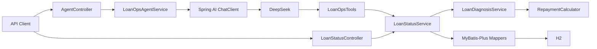

# Architecture

## 1. 设计目标

LoanOps Agent 的核心不是组件数量，而是把“确定性金融事实”和“概率型自然语言能力”分开。

- Java 领域层拥有金额、日期、逾期和结清规则；
- REST 可以绕过 AI 独立验证业务事实；
- Tool 只是业务能力的只读适配器；
- Agent 只负责意图理解、Tool 选择和解释；
- 数据库和模型 Provider 都属于可替换基础设施，不应改写核心业务算法。

## 2. 当前运行链路



## 3. 各层职责

| 层 | 负责 | 不负责 |
|---|---|---|
| `RepaymentCalculator` | 应还、已还、未还的确定性金额计算 | 数据访问、LLM、HTTP |
| `LoanDiagnosisService` | 当前期次、逾期、结清判断 | Mapper、Prompt |
| `LoanStatusService` | 加载贷款数据并编排诊断 | 重新实现领域算法 |
| `LoanStatusController` | 暴露确定性 REST API | 金额/逾期计算 |
| `LoanOpsTools` | 把 Service 暴露成 3 个只读 AI Tool | 直接访问 Mapper、写数据库 |
| `LoanOpsAgentService` | 系统约束、ChatClient、Tool Calling | 计算金融事实 |
| Provider | 语言理解与回答生成 | 成为业务事实来源 |

## 4. 事实来源

业务规则只有一套实现路径：

```text
RepaymentCalculator
        ↓
LoanDiagnosisService
        ↓
LoanStatusService
      ↙     ↘
   REST      Tool
               ↓
             Agent
```

如果 REST 与 Agent 结果不一致，先用 REST / Service 测试验证 Java 事实，再排查 Tool Calling 或模型输出。这使 AI 故障和业务故障可以拆开定位。

## 5. 数据模型

当前只有三张表：

```text
loan_contract
    1
    │
    └── n repayment_plan
              1
              │
              └── n payment_record
```

`OVERDUE`、`SETTLED` 不作为持久化真相保存，而是根据计划与还款记录动态计算，避免派生状态和基础数据不一致。

## 6. 时间与可复现性

领域代码只从注入的 `Clock` 获取业务日期。默认使用系统日期；演示与验收可以通过：

```text
loanops.business-date=2026-08-23
loanops.business-zone=Asia/Shanghai
```

生成固定 `Clock`，从而让 `LN-10002` 的 `overdueDays=3` 在未来仍可重复验证。

## 7. Provider 扩展点

Agent 依赖 Spring AI `ChatClient`，而不是在业务类中调用某个厂商 SDK。

```text
LoanOpsAgentService
       ↓
   ChatClient
       ↓
   ChatModel
    /  |  \
DeepSeek Qwen GLM
```

当前只把 DeepSeek 作为已接入、已验证 Provider。Qwen/GLM 后续应通过独立配置/Adapter 接入，并复用同一套 3 个 Tool 和 E2E Case。详见 `PROVIDERS.md`。

## 8. 数据库扩展点

当前 `LoanStatusService` 直接依赖 MyBatis Mapper，对这个小型服务足够简单。若未来同时支持 H2、MySQL、外部信贷 API 等多种数据源，再引入 Repository Port / Adapter 更合适。

当前不提前增加抽象层，原因是：只有一种持久化实现时，额外接口不会带来真实替换收益，反而增加样板代码。

## 9. 写操作边界

当前 Agent 没有写 Tool，因此安全边界是结构性的，而不只是 Prompt 约束。

未来如果增加任何写操作，不能简单加入 `defaultTools`。至少需要单独设计：权限、显式确认、幂等、审计、失败恢复和按请求授权。在这些机制完成前，Agent 保持只读。
